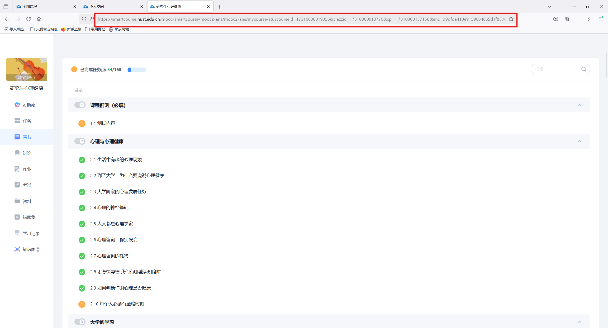

# AutoCourse

## 用法

### 依赖

```shell
pip install selenium
```

### 登录设置

1. 首先需要在浏览器中登录课程平台，**确保关闭浏览器再打开后无需重复登录**
2. 进入到对应课程的`章节`页面，拿到此时的url
   
3. （可选）打开一个视频并播放，设置为二倍速和静音。可以避免脚本运行后再设置

### 参数设置

使用前需要配置脚本中的config变量

```python
config = {
    'url': 'https://smartcourse.hust.edu.cn/mooc-smartcourse/mooc2-ans/mooc2-ans/mycourse/stu?courseid=17310000019056&clazzid=17310000010770&cpi=17310000137156&enc=3a6de4f059b5aae1803055b41eeb4aa3&t=1741790144317&pageHeader=1&v=0',
    'userData': 'C:\\Users\\15358\\AppData\\Local\\Google\\Chrome\\User Data',
    'startChapter': 3,
    'startTask': 1,
    'endChapter': 7,
    'endTask': 15,
}
```
- url: 课程页面的地址，之前获取的url
- userData：浏览器用户数据目录
- startChapter：开始章节
- startTask：开始小节
- endChapter：结束章节
- endTask：结束小节

### 运行

```shell
cd AutoCourse
python auto_course.py
```

## 不便之处

因为元素定位的需要，脚本需要频繁将聚焦窗口设置为课程页面。

在脚本开始后，将带来以下副作用：
- 浏览器窗口将频繁被拉起，即使被最小化。如果你只有一个屏幕，那么将无法使用电脑。
- Chrome将无法使用

**建议解决方法：**
- 如果你有副屏，可以将浏览器窗口放到副屏，并正常使用。但仍然无法使用Chrome
- 挂机使用脚本
- 在虚拟机中运行
- 【推荐】可以将脚本中的`DEBUG`设置为False，此时运行脚本将会以无头模式打开浏览器。（你将看不到浏览器界面，但好处是不会影响正常使用，但仍然无法使用Chrome）


## 注意事项

- 目前仅支持Chrome浏览器，火狐等其他浏览器暂未适配
- 运行时注意事项：
  - 脚本在刚进入课程页面，以及播完视频即将跳转到下一任务时，会有滑动列表的操作。**请不要在此时使用鼠标在窗口中乱动！！！**
  - 脚本运行时电脑不能进入**休眠**或**注销**状态
  - 不能在未登录状态下运行脚本。如果使用远程桌面，则远程桌面需要保持连接
- 目前仅支持`研究生心理健康`课程
  - 其他课程未测试
  - 如果用于其他课程，则需要修改脚本中的`chapter_info`中的章节信息


